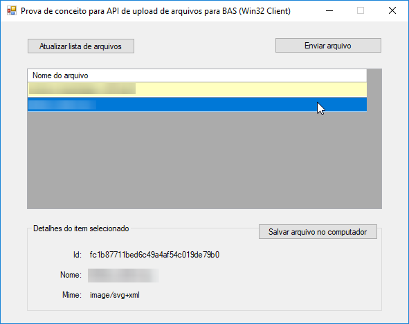

# BAS.Concept.File.Upload.WinManager

Prova de conceito para API de upload de arquivos para BAS (Win32 Client)



## Adicionando a biblioteca em sua aplicação

```shell
PM> Install-Package BAS.Concept.File.Upload.Client -Version 1.0.0
```

## Obter a lista dos arquivos

```cs
using BAS.Concept.File.Upload.Client;

var client = new BasConceptFileUploadClient();

IEnumerable<WebFileInfo> files = client.GetAllFiles().Data;

foreach (var fileInfo in files)
{
	/* Use as informações */
}
```

## Obter os detalhes de um arquivo

```cs
using BAS.Concept.File.Upload.Client;

var client = new BasConceptFileUploadClient();

WebFileInfo file = client.GetFileInfo().Data;

/* Use as informações */
```

## Enviar um arquivo

```cs
using BAS.Concept.File.Upload.Client;

var client = new BasConceptFileUploadClient();
var filePath = "...";

using (var fileStream = new FileStream(filePath, FileMode.Open))
{
    client.SendFile(fileStream, Path.GetFileName(filePath));
}
```

## Baixar um arquivo

```cs
using BAS.Concept.File.Upload.Client;

var client = new BasConceptFileUploadClient();
var fileId = "...";
var filePath = "...";

using (var webStream = client.GetFileContent(fileId))
using (var fileStream = new FileStream(filePath, FileMode.Create))
{
    webStream.CopyTo(fileStream);
}
```

## WebFileInfo

As informações de um arquivo

```cs
public class WebFileInfo
{
    public string Name { get; set; }
    public string Id { get; set; }
    public string MimeType { get; set; }
}
```

## Cliente Web
Um cliente web dessa prova de conceito pode ser encontrada em https://github.com/erlimar/bas-concept-file-upload-webclient

### Demonstração
Você pode ver uma demonstração online em https://unpkg.com/bas-concept-file-upload-webclient/index.html

## Servidor

A parte do lado do servidor dessa prova de conceito pode ser encontrada em https://github.com/erlimar/bas-concept-file-upload-api

## Download

Você pode baixar um binário para teste imediato em seu computador [escolhendo uma das versões disponíveis aqui](https://github.com/erlimar/BAS.Concept.File.Upload.WinManager/releases).

### Pré-requisitos

* Windows 7 ou superior
* .NET Framework 4.6.2 ou superior
